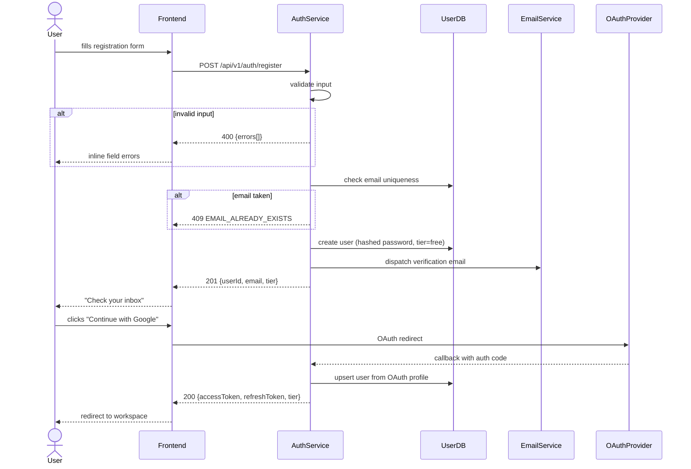
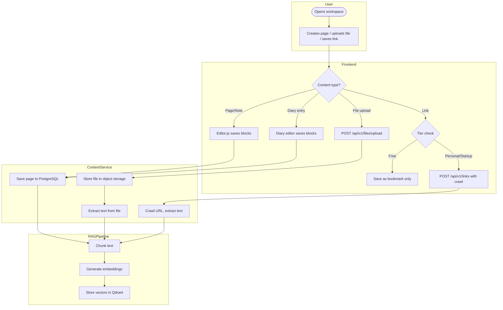
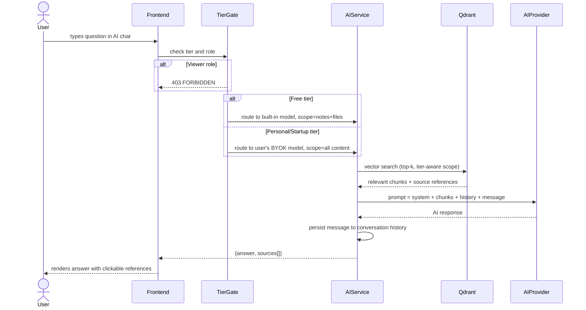

# Requirements — AI-Powered Note Platform (Knowledgebase GPT)

## 1. Overview

A SaaS note-taking platform similar to Notion where users can capture knowledge across multiple content types: notes/documents, files, links, and diary entries. The platform integrates AI via RAG (Retrieval-Augmented Generation) so users can query their knowledge base using a dedicated chat interface and get AI assistance for content generation and editing. The platform offers three tiers — Free, Personal, and Startup — each unlocking progressively more content types, AI capability, and collaboration features.

### Tier Feature Matrix

| Feature | Free | Personal | Startup |
|---------|------|----------|---------|
| **Blocks** | 1,000 per workspace | Unlimited | Unlimited |
| **Content: Notes** | Yes | Yes | Yes |
| **Content: Links (bookmark)** | Yes | Yes | Yes |
| **Content: Links (content fetch + RAG index)** | No | Yes | Yes |
| **Content: Files** | Yes — 5MB max per file | Yes — 100MB max per file | Yes — 100MB max per file |
| **Content: Diary (private module)** | No | Yes | Yes |
| **AI model** | 1 built-in (platform-managed) | Bring Your Own API Key (BYOK) | Multi-model + BYOK |
| **RAG search** | Basic — notes + files only | Full — all content types | Full — all team docs |
| **In-editor AI generation** | No | Yes | Yes |
| **Version history** | No | Yes | Yes |
| **Workspace type** | Personal only | Personal only | Shared (team) |
| **Collaboration & roles** | No | No | Yes (Owner / Member / Viewer) |
| **Permission control** | No | No | Yes |
| **Priority support** | No | No | Yes |

---

## 2. Actors

| Actor            | Tier        | Description                                                                 |
| ---------------- | ----------- | --------------------------------------------------------------------------- |
| **Free User**    | Free        | Single-user personal workspace; limited blocks, notes + links + files, basic RAG with built-in model |
| **Personal User**| Personal    | Single-user workspace; unlimited blocks, all content types, BYOK AI, version history |
| **Owner**        | Startup     | Creates and owns a shared workspace; full control over content, members, and settings |
| **Member**       | Startup     | Invited to a shared workspace; can create, edit, and delete content |
| **Viewer**       | Startup     | Read-only access to workspace content; cannot create, edit, or use AI features |
| **System**       | All         | Background jobs: file processing, link crawling, RAG indexing, version snapshots |
| **AI Provider**  | All         | Built-in platform model (Free); external API — OpenAI, Gemini, Anthropic (Personal/Startup); local runtime — Ollama (Personal/Startup) |
| **Auth Provider**| All         | Google OAuth (Phase 1); GitHub, Microsoft OAuth (Phase 2) |

---

## 3. User Story Map

### Activity 1: Join the Platform

#### Step 1 — User registers an account · Actor: Any User

**US-AUTH-001**: As a new visitor, I want to register with my email and password, so that I can create an account and start using the platform.

Acceptance Criteria:
- AC-1: Given valid display name, email, and password, when I click Register, then an account is created and I receive a verification email.
- AC-2: Given an already-registered email, when I submit, then I see an "email already in use" error and no account is created.
- AC-3: Given invalid input (weak password, malformed email), when I submit, then I see inline field errors.

Business Conditions:
- BC-1: Display name: 2–50 characters.
- BC-2: Password: ≥8 chars, ≥1 uppercase, ≥1 digit, ≥1 special character.
- BC-3: Email verification token expires after 24 hours.
- BC-4: Maximum 3 verification email resend requests per hour per address.
- BC-5: New registrations start on the Free tier by default.

Priority: Must Have

---

#### Step 2 — User logs in · Actor: Any User

**US-AUTH-002**: As a registered user, I want to log in with email/password or Google OAuth, so that I can access my workspace.

Acceptance Criteria:
- AC-1: Given valid credentials, when I log in, then I receive a JWT access token and refresh token and am redirected to my workspace.
- AC-2: Given invalid credentials, when I log in, then I see a generic "invalid email or password" message.
- AC-3: Given I click "Continue with Google", when I complete the OAuth flow, then an account is created (if first time) or I am logged in and redirected to my workspace.
- AC-4: Given my access token is expired, when I make an API call, then a new access token is silently issued using my refresh token.

Business Conditions:
- BC-1: Maximum 10 failed login attempts per IP per minute before rate limiting.
- BC-2: Access token expires after 15 minutes; refresh token expires after 30 days.
- BC-3: Each device session identified by `x-device-id` header.

Priority: Must Have

---

### Activity 2: Set Up a Workspace

#### Step 3 — User creates a personal workspace · Actor: Free User / Personal User

**US-WS-001**: As a new user, I want to create a personal workspace with a name, so that I have a dedicated space to organize my knowledge.

Acceptance Criteria:
- AC-1: Given I provide a workspace name, when I click Create, then the workspace is created and I am set as the owner.
- AC-2: Given the workspace is created, when I access it, then I see an empty sidebar with a prompt to create the first page.
- AC-3: Given I am on the Free tier and my workspace has reached 1,000 blocks, when I try to create a new block, then I see a "block limit reached — upgrade to Personal" prompt and the action is blocked.

Business Conditions:
- BC-1: Workspace name: 2–100 characters.
- BC-2: Free tier: max 1,000 Editor.js blocks across all pages in the workspace.
- BC-3: Personal tier: unlimited blocks.
- BC-4: A workspace slug is auto-generated from the name and must be unique per platform.

Priority: Must Have

---

#### Step 4 — Startup user creates a shared workspace · Actor: Owner (Startup Tier)

**US-WS-002**: As a Startup-tier user, I want to create a shared workspace for my team, so that we can build a collective knowledge base.

Acceptance Criteria:
- AC-1: Given I am on the Startup tier, when I create a workspace, then I can invite team members and assign roles.
- AC-2: Given I am on Free or Personal tier, when I try to invite a member to my workspace, then I see an "upgrade to Startup required" prompt and the action is blocked with HTTP 403 PLAN_REQUIRED.

Business Conditions:
- BC-1: Shared workspaces are exclusive to the Startup tier.
- BC-2: The workspace creator is automatically assigned the Owner role.

Priority: Must Have

---

#### Step 5 — Owner invites team members · Actor: Owner (Startup Tier)

**US-COLLAB-001**: As a workspace owner on the Startup tier, I want to invite users by email and assign them a role (Member or Viewer), so that we can collaborate on the knowledge base.

Acceptance Criteria:
- AC-1: Given a valid email and role, when I send an invitation, then the invitee receives an email with a join link.
- AC-2: Given the invitee clicks the link and accepts, then they are added to the workspace with the assigned role.
- AC-3: Given the invitee is not yet registered, when they click the join link, then they are directed to register first and then joined to the workspace.
- AC-4: Given an already-pending invitation for an email, when I try to invite the same email again, then I see a "pending invite already exists" error.

Business Conditions:
- BC-1: Invitation link expires after 7 days.
- BC-2: Owner can change a member's role or remove them at any time.

Priority: Must Have

---

#### Step 6 — Owner manages roles and permissions · Actor: Owner (Startup Tier)

**US-COLLAB-002**: As a workspace owner, I want to manage member roles and remove members, so that I control who can access and edit the knowledge base.

Acceptance Criteria:
- AC-1: Given I select a member, when I change their role, then their permissions update immediately.
- AC-2: Given I remove a member, when confirmed, then they lose access to the workspace immediately.
- AC-3: Given I am a Viewer, when I attempt to create or edit content, then I receive a 403 FORBIDDEN response.
- AC-4: Given I am a Viewer, when I navigate to any AI feature, then I see an access denied message.

Business Conditions:
- BC-1: Only the Owner can transfer ownership or delete the workspace.
- BC-2: An owner cannot remove themselves; they must transfer ownership first.
- BC-3: Permission enforcement applies to all roles: Viewer is read-only; Member cannot manage workspace settings or members.

Priority: Must Have

---

### Activity 3: Organize Content

#### Step 7 — User creates folders and pages · Actor: Any authenticated user (within their tier's content access)

**US-ORG-001**: As a workspace user, I want to create folders to group related pages, so that I can organize my knowledge base into logical sections.

Acceptance Criteria:
- AC-1: Given I create a folder with a name, when confirmed, then the folder appears in the workspace sidebar.
- AC-2: Given I create a page inside a folder, then the page is nested under that folder.
- AC-3: Given I drag and drop a page into a different folder, then the page moves to the new folder.

Business Conditions:
- BC-1: Folder name: 1–100 characters.
- BC-2: Maximum folder nesting depth: 3 levels (workspace → folder → sub-folder).

Priority: Must Have

---

#### Step 8 — User creates and edits a page · Actor: Any authenticated user

**US-PAGE-001**: As a workspace user, I want to create a page with a title and rich-text content using Editor.js, so that I can document knowledge in a structured format.

Acceptance Criteria:
- AC-1: Given I create a page, when the editor loads, then I can write content using Editor.js blocks (text, headings, lists, code, tables, images, etc.).
- AC-2: Given I edit and save a page, when I navigate away and return, then my changes are persisted.
- AC-3: Given I create a sub-page inside a page, when it is created, then it appears nested under the parent in the sidebar.
- AC-4: Given I am on the Free tier and adding a block would exceed 1,000, when I try to add it, then I see the block limit prompt and the block is not created.

Business Conditions:
- BC-1: Pages auto-save with a debounce of 2 seconds after the last keystroke.
- BC-2: Maximum sub-page nesting depth: 5 levels.
- BC-3: Page title: 1–255 characters.
- BC-4: Each Editor.js block element (paragraph, heading, image, list item, code block, etc.) counts as 1 block toward the workspace total.

Priority: Must Have

---

### Activity 4: Capture Knowledge

#### Step 9 — User writes a diary entry · Actor: Personal User / Startup Member/Owner

**US-DIARY-001**: As a Personal or Startup-tier user, I want to create a private diary entry tied to a specific date, so that I can log daily thoughts and reflections alongside my knowledge base.

Acceptance Criteria:
- AC-1: Given I open the Diary section, when I create an entry, then it is associated with the selected date (defaulting to today).
- AC-2: Given I navigate to a past date, when I open its entry, then I see the content I wrote for that day.
- AC-3: Given a date already has an entry, when I try to create another for the same date, then I am redirected to the existing entry.
- AC-4: Given I am on the Free tier, when I navigate to the Diary section, then I see an "upgrade to Personal" prompt and cannot create entries.

Business Conditions:
- BC-1: One diary entry per date per user per workspace.
- BC-2: Diary entries use the same Editor.js rich-text editor as pages.
- BC-3: Diary entries are private to the individual user — not visible to other workspace members even on Startup tier.
- BC-4: Diary is available on Personal and Startup tiers only.

Priority: Must Have

---

#### Step 10 — User uploads a file · Actor: Any authenticated user (tier-limited)

**US-FILE-001**: As a workspace user, I want to upload a file so that I can store and reference it within my knowledge base.

Acceptance Criteria:
- AC-1: Given I upload a supported file within my tier's size limit, when the upload completes, then the file appears in the file library and on the page where it was attached.
- AC-2: Given an unsupported file type, when I try to upload it, then I see an error listing supported formats.
- AC-3: Given a file exceeds my tier's size limit, when I try to upload it, then I see a file-size error.
- AC-4: Given a PDF/DOC/Markdown file is uploaded, when processing completes, then its text is extracted, chunked, and indexed into the vector database for RAG.
- AC-5: Given an image is uploaded, when processing completes, then it is stored but not indexed for text RAG.

Business Conditions:
- BC-1: Supported types: `.pdf`, `.md`, `.doc`, `.docx`, `.xls`, `.xlsx`, `.png`, `.jpg`, `.jpeg`, `.webp`, `.gif`.
- BC-2: Maximum file size: 5MB per file on Free tier; 100MB per file on Personal and Startup tiers.
- BC-3: File processing (text extraction + vectorisation) must complete within 60 seconds for files under 5MB.

Priority: Must Have

---

#### Step 11 — Free user saves a link as a bookmark · Actor: Free User

**US-LINK-001**: As a Free-tier user, I want to save a URL as a bookmark, so that I have a record of the link inside my workspace.

Acceptance Criteria:
- AC-1: Given I paste a valid URL and click Save, when confirmed, then the link is saved with its URL and the date saved.
- AC-2: Given I view a saved link, then I see the URL, date saved, and a "Content fetch available on Personal plan" indicator.
- AC-3: Given I am on the Free tier, when I attempt to trigger manual content fetch, then I see an upgrade prompt and the action is blocked with HTTP 403 PLAN_REQUIRED.

Business Conditions:
- BC-1: URL must be a valid `http` or `https` address.
- BC-2: Free tier stores URL and save date only — no crawling, no content extraction, no RAG indexing.

Priority: Must Have

---

#### Step 12 — Personal/Startup user saves a link with content fetch · Actor: Personal User / Startup Member/Owner

**US-LINK-002**: As a Personal or Startup-tier user, I want to save a URL and have the platform fetch and embed the page content, so that I can query that content via AI RAG.

Acceptance Criteria:
- AC-1: Given I paste a URL and click Save, when the system crawls the page, then the title, description, and main body text are extracted and stored.
- AC-2: Given the crawl completes, when processing finishes, then the page content is chunked and indexed into the vector database for RAG.
- AC-3: Given the URL is unreachable, when the system fails to crawl, then the link is saved with "crawl_failed" status and I can retry manually.
- AC-4: Given I view a saved link, then I see the URL, fetched title, preview snippet, date saved, and date last refreshed.
- AC-5: Given a link was saved more than 7 days ago, when the weekly auto-refresh job runs, then the system re-crawls the URL, updates stored content, and re-indexes the vectors.
- AC-6: Given auto-refresh finds the URL unreachable, when the job runs, then the link status is updated to "crawl_failed" and I am notified.

Business Conditions:
- BC-1: URL must be a valid `http` or `https` address.
- BC-2: Maximum page content extracted per link: 500KB of text.
- BC-3: Crawling respects `robots.txt` directives.
- BC-4: Links auto-refresh weekly (every 7 days from last successful crawl).
- BC-5: Manual re-crawl at most once per hour per URL.

Priority: Must Have

---

#### Step 13 — Personal/Startup user views page version history · Actor: Personal User / Startup Member/Owner

**US-VERSION-001**: As a Personal or Startup-tier user, I want to view the version history of a page and restore a previous version, so that I can recover from accidental edits.

Acceptance Criteria:
- AC-1: Given I open a page's version history, when it loads, then I see a list of saved versions with timestamps and the name of who made the change.
- AC-2: Given I select a past version, when I click Restore, then the page content is replaced with that version and a new version snapshot is created.
- AC-3: Given I am on the Free tier, when I try to access version history for a page, then I see an "upgrade to Personal" prompt.

Business Conditions:
- BC-1: A version snapshot is created on every auto-save.
- BC-2: Version history is retained for a maximum of 90 days.
- BC-3: Version history is available on Personal and Startup tiers only.

Priority: Must Have

---

### Activity 5: Search and Query with AI

#### Step 14 — User performs semantic search · Actor: All tiers and roles

**US-SEARCH-001**: As any workspace user, I want to search my knowledge base by meaning rather than exact keywords, so that I can find relevant content even when I don't remember the exact wording.

Acceptance Criteria:
- AC-1: Given I type a query in the search bar, when I submit, then the system returns the top-ranked content items by vector similarity.
- AC-2: Given search results are returned, when I view them, then each result shows the content type, title, a matching excerpt, and a link to the source.
- AC-3: Given I am on the Free tier, when I search, then results include notes, files, and diary entries — but NOT link content (links are not indexed on Free tier).
- AC-4: Given I am on Personal or Startup tier, when I search, then results include crawled link content in addition to all other content types.

Business Conditions:
- BC-1: Semantic search is available to all tiers and all roles including Viewer.
- BC-2: Search returns results from the current workspace scope only.
- BC-3: Maximum 20 results returned, ordered by similarity score.

Priority: Must Have

---

#### Step 15 — User chats with the built-in AI (Free tier) · Actor: Free User

**US-AI-FREE-001**: As a Free-tier user, I want to ask questions about my notes and files using the platform's built-in AI model, so that I can get answers from my knowledge base without configuring my own API key.

Acceptance Criteria:
- AC-1: Given I open the AI chat, when I send a message, then the system uses the platform-managed built-in model to generate an answer using RAG over my notes and files.
- AC-2: Given the AI responds, when the response references specific pages or files, then clickable source references are shown.
- AC-3: Given I leave and return to the chat, when I open it, then my previous conversation history is preserved and private to me.
- AC-4: Given no relevant content exists, when I ask a question, then the AI indicates no references were found and responds from general knowledge.

Business Conditions:
- BC-1: Free tier uses 1 platform-managed built-in model (model identity TBD by platform).
- BC-2: RAG scope on Free tier: notes and files only (no diary — not available; no links — not indexed).
- BC-3: The built-in model is provided by the platform at its cost; usage limits (messages/day) may apply — TBD.
- BC-4: Chat history is stored per user; maximum 30 conversations retained on Free tier.
- BC-5: User cannot change or configure the built-in model on the Free tier.

Priority: Must Have

---

#### Step 16 — User configures their own AI model · Actor: Personal User / Startup Member/Owner

**US-AI-001**: As a Personal or Startup-tier user, I want to select my preferred AI model and provide my API key, so that the AI features use the provider and model I choose.

Acceptance Criteria:
- AC-1: Given I open AI Settings, when I select a provider (OpenAI, Gemini, Anthropic, Ollama), then I can enter my API key (or Ollama base URL for local).
- AC-2: Given a valid API key, when I save, then the system validates the key with a test call and confirms it is active.
- AC-3: Given an invalid API key, when I save, then I see an "API key validation failed" error.
- AC-4: Given I select Ollama, when I provide the base URL and select a local model, then the AI features route requests to that endpoint.
- AC-5: Given I am on the Startup tier, when I configure models, then I can add multiple providers and switch between them per conversation.

Business Conditions:
- BC-1: API keys are encrypted at rest using AES-256 and never returned in API responses.
- BC-2: Personal tier: one active BYOK configuration per user.
- BC-3: Startup tier: multiple model configurations; user selects active model per conversation.
- BC-4: Supported providers: OpenAI, Google Gemini, Anthropic, Ollama (local).

Priority: Must Have

---

#### Step 17 — Personal/Startup user chats with full RAG · Actor: Personal User / Startup Member/Owner

**US-AI-002**: As a Personal or Startup-tier user, I want to open a dedicated AI chat page and ask questions across all my content types, so that I can retrieve insights from notes, documents, diary entries, files, and links.

Acceptance Criteria:
- AC-1: Given I open the AI chat, when I send a message, then the system retrieves relevant chunks from all indexed content (including diary and crawled links) and passes them to my configured model.
- AC-2: Given the AI responds, when the response references sources, then clickable source references (type, title, path) are included.
- AC-3: Given I want to scope my query, when I select a specific folder, then RAG retrieves only from content in that folder.
- AC-4: Given I leave and return to the chat, when I open it, then my previous conversation history is preserved and private to me.
- AC-5: Given no relevant content exists, when I ask a question, then the AI indicates no references were found and responds from general knowledge.
- AC-6: Given I am a Viewer, when I navigate to the AI chat page, then the chat input is disabled with an access denied message.

Business Conditions:
- BC-1: RAG retrieves the top-k most relevant chunks (default k=5, configurable up to k=20).
- BC-2: Chat history is stored per user — never shared with other workspace members.
- BC-3: Maximum 100 conversations retained per user per workspace; oldest purged when exceeded.
- BC-4: Startup tier RAG includes all team members' indexed content within the shared workspace (excluding private diary entries).
- BC-5: Viewer role is blocked from all AI features: chat, in-editor generation, and model settings.

Priority: Must Have

---

#### Step 18 — Personal/Startup user uses AI in the editor · Actor: Personal User / Startup Member/Owner

**US-AI-003**: As a Personal or Startup-tier user, I want to use AI within the page editor to generate or improve content, so that I can write faster and produce higher-quality notes.

Acceptance Criteria:
- AC-1: Given I position my cursor or select text in the editor, when I invoke `/ai`, then a prompt input appears.
- AC-2: Given I type a generation prompt, when I confirm, then the AI generates text and inserts it as a new Editor.js block.
- AC-3: Given I select existing text and invoke AI edit, when I confirm, then the selected text is replaced with the AI's output.
- AC-4: Given I reject the AI output, when I click Discard, then the original content is restored.
- AC-5: Given I am on the Free tier, when I invoke `/ai` in the editor, then I see an "upgrade to Personal" prompt and the command is blocked.

Business Conditions:
- BC-1: AI-generated content is inserted as a standard Editor.js block and fully editable afterward.
- BC-2: Uses the user's configured model and API key (Personal/Startup only).
- BC-3: Maximum input context sent to AI for in-editor operations: 8,000 tokens.
- BC-4: In-editor AI is available on Personal and Startup tiers only.

Priority: Must Have

---

## 4. Business Flow — Swimlane

### Authentication Flow



### Content Capture & RAG Indexing Flow (Personal/Startup)



### AI Chat Flow (Tier-aware)



---

## 5. Input / Output Field Specification

### POST /api/v1/auth/register

**Input**

| Field         | Type     | Required | Constraints                                      | Example             |
| ------------- | -------- | -------- | ------------------------------------------------ | ------------------- |
| `displayName` | `string` | Yes      | 2–50 chars                                       | `Alice Nguyen`      |
| `email`       | `string` | Yes      | Valid email format                               | `alice@example.com` |
| `password`    | `string` | Yes      | 8–64 chars, ≥1 upper, ≥1 digit, ≥1 special char | `SecureP@ss1`       |

**Output (201)**

| Field         | Type     | Always present | Notes                          |
| ------------- | -------- | -------------- | ------------------------------ |
| `userId`      | `string` | Yes            | UUID v4                        |
| `email`       | `string` | Yes            | Lowercased                     |
| `displayName` | `string` | Yes            |                                |
| `tier`        | `enum`   | Yes            | `free` \| `personal` \| `startup` |
| `createdAt`   | `string` | Yes            | ISO 8601 UTC                   |
| `password`    | —        | Never          | Must not appear in output      |

---

### POST /api/v1/pages

**Input**

| Field      | Type     | Required    | Constraints                        | Example           |
| ---------- | -------- | ----------- | ---------------------------------- | ----------------- |
| `title`    | `string` | Yes         | 1–255 chars                        | `Meeting Notes`   |
| `folderId` | `string` | No          | UUID of parent folder              | `abc-123`         |
| `parentId` | `string` | No          | UUID of parent page                | `def-456`         |
| `type`     | `enum`   | Yes         | `note`, `document`, `diary`        | `note`            |
| `date`     | `string` | Diary only  | ISO 8601 date                      | `2026-03-28`      |
| `content`  | `object` | No          | Editor.js JSON blocks              | `{blocks: [...]}`  |

**Output (201)**

| Field       | Type     | Notes        |
| ----------- | -------- | ------------ |
| `pageId`    | `string` | UUID v4      |
| `title`     | `string` |              |
| `type`      | `string` |              |
| `createdAt` | `string` | ISO 8601 UTC |
| `updatedAt` | `string` | ISO 8601 UTC |
| `createdBy` | `string` | userId       |

---

### POST /api/v1/ai/chat

**Input**

| Field            | Type     | Required | Constraints                                           | Example                   |
| ---------------- | -------- | -------- | ----------------------------------------------------- | ------------------------- |
| `message`        | `string` | Yes      | 1–4000 chars                                          | `What are my Q1 goals?`   |
| `conversationId` | `string` | No       | UUID; omit to start new conversation                  | `conv-uuid`               |
| `scope`          | `object` | No       | `{type: "folder", id: "uuid"}` or `{type: "all"}`    | `{type: "all"}`           |
| `modelConfig`    | `object` | No       | Override active model; Personal/Startup tier only     | `{provider: "openai", model: "gpt-4o"}` |

**Output (200)**

| Field            | Type     | Notes                                      |
| ---------------- | -------- | ------------------------------------------ |
| `answer`         | `string` | AI-generated response                      |
| `sources`        | `array`  | Source references used in RAG context      |
| `conversationId` | `string` | UUID of the conversation                   |
| `messageId`      | `string` | UUID of this message pair                  |
| `modelUsed`      | `string` | Identifier of the model that responded     |

**Source Reference Object**

| Field   | Type     | Notes                                |
| ------- | -------- | ------------------------------------ |
| `type`  | `enum`   | `page`, `file`, `link`, `diary`      |
| `id`    | `string` | UUID of the source item              |
| `title` | `string` | Display title                        |
| `path`  | `string` | Workspace path (e.g. `/folder/page`) |

---

### Error Code Registry

| HTTP Status | Code                     | When                                                        |
| ----------- | ------------------------ | ----------------------------------------------------------- |
| 400         | `VALIDATION_ERROR`       | One or more input fields fail validation                    |
| 400         | `INVALID_FORMAT`         | Field does not match required pattern                       |
| 400         | `FILE_TYPE_NOT_SUPPORTED`| Uploaded file extension is not allowed                      |
| 400         | `FILE_TOO_LARGE`         | File exceeds the tier's size limit                          |
| 400         | `INVALID_URL`            | Submitted link is not a valid http/https URL                |
| 400         | `BLOCK_LIMIT_EXCEEDED`   | Adding this block would exceed the Free tier 1,000 block cap |
| 401         | `UNAUTHORIZED`           | Missing or invalid access token                             |
| 403         | `FORBIDDEN`              | Authenticated but insufficient role permissions             |
| 403         | `PLAN_REQUIRED`          | Feature is not available on the user's current tier         |
| 404         | `NOT_FOUND`              | Requested resource does not exist                           |
| 409         | `EMAIL_ALREADY_EXISTS`   | Email is already registered                                 |
| 409         | `DIARY_DATE_CONFLICT`    | Diary entry for this date already exists                    |
| 409         | `INVITE_ALREADY_PENDING` | An invitation for this email is already pending             |
| 429         | `RATE_LIMITED`           | Too many requests                                           |
| 500         | `INTERNAL_ERROR`         | Unexpected server error                                     |
| 502         | `AI_PROVIDER_ERROR`      | Upstream AI provider returned an error                      |
| 503         | `CRAWL_FAILED`           | Link crawling failed — URL unreachable                      |

---

## 6. Functional Requirements

### Authentication

```
FR-AUTH-001: The system shall create a user account on the Free tier when displayName,
             email, and password pass all validation rules and the email is not already registered.

FR-AUTH-002: The system shall reject registration with HTTP 400 and field-level errors
             when any required field fails validation.

FR-AUTH-003: The system shall reject registration with HTTP 409 EMAIL_ALREADY_EXISTS
             when the submitted email is already registered.

FR-AUTH-004: The system shall store passwords as bcrypt hashes (min cost factor 12)
             and must never store or return the plaintext password.

FR-AUTH-005: The system shall dispatch a verification email within 60 seconds
             of account creation.

FR-AUTH-006: The system shall issue a JWT access token (15-min expiry) and a refresh
             token (30-day expiry) upon successful login.

FR-AUTH-007: The system shall silently reissue an access token using a valid refresh
             token when the access token is expired.

FR-AUTH-008: The system shall support Google OAuth 2.0 login; creating a new account
             (Free tier) on first OAuth login if no account with that email exists.
```

### Tier Enforcement

```
FR-TIER-001: The system shall track the total block count per workspace and reject
             new block creation with HTTP 400 BLOCK_LIMIT_EXCEEDED when a Free-tier
             workspace reaches 1,000 blocks.

FR-TIER-002: The system shall reject diary creation, version history access, and
             in-editor AI commands from Free-tier users with HTTP 403 PLAN_REQUIRED.

FR-TIER-003: The system shall reject link content fetch requests from Free-tier
             workspaces with HTTP 403 PLAN_REQUIRED.

FR-TIER-004: The system shall reject file uploads exceeding 5MB from Free-tier users
             and file uploads exceeding 100MB from Personal/Startup users with
             HTTP 400 FILE_TOO_LARGE.

FR-TIER-005: The system shall reject shared workspace creation and member invitations
             from Free and Personal-tier users with HTTP 403 PLAN_REQUIRED.

FR-TIER-006: The system shall reject BYOK AI model configuration from Free-tier users
             with HTTP 403 PLAN_REQUIRED.
```

### Workspace & Collaboration

```
FR-WS-001: The system shall create a workspace with a unique slug derived from its name
           when an authenticated user submits a valid workspace name.

FR-WS-002: The system shall set the workspace creator as the owner automatically.

FR-COLLAB-001: The system shall send an invitation email to the invitee when a Startup-tier
               Owner submits a valid email address and role selection.

FR-COLLAB-002: The system shall add the invitee to the workspace with the assigned role
               when they accept the invitation via the join link.

FR-COLLAB-003: The system shall enforce role-based access: Viewer cannot create, edit,
               or delete any content and cannot access any AI features; Member cannot
               manage workspace settings or members.

FR-COLLAB-004: The system shall immediately revoke workspace access when a member
               is removed by the Owner.
```

### Content Management

```
FR-PAGE-001: The system shall create a page with the provided title, type, and optional
             Editor.js content block structure.

FR-PAGE-002: The system shall support page nesting up to 5 levels deep via a parentId reference.

FR-PAGE-003: The system shall auto-save page content 2 seconds after the last detected
             keystroke with no explicit save action required.

FR-PAGE-004: The system shall create a version snapshot on every auto-save for
             Personal and Startup-tier workspaces and retain snapshots for 90 days.

FR-PAGE-005: The system shall enforce one diary entry per date per user per workspace
             and return HTTP 409 DIARY_DATE_CONFLICT on duplicate.

FR-PAGE-006: The system shall block diary entry creation for Free-tier users with
             HTTP 403 PLAN_REQUIRED.

FR-FILE-001: The system shall accept file uploads for the types: pdf, md, doc, docx,
             xls, xlsx, png, jpg, jpeg, webp, gif.

FR-FILE-002: The system shall enforce per-tier file size limits:
             5MB for Free tier; 100MB for Personal and Startup tiers.

FR-FILE-003: The system shall extract text content from PDF, Markdown, DOC, and DOCX files
             and index it in the vector database within 60 seconds for files under 5MB.

FR-LINK-001: The system shall save any valid http/https URL as a bookmark (URL + save date)
             for all workspace tiers without performing a crawl.

FR-LINK-002: The system shall reject link content fetch requests from Free-tier workspaces
             with HTTP 403 PLAN_REQUIRED.

FR-LINK-003: The system shall crawl the submitted URL and extract the page title,
             description, and main body text when a Personal or Startup-tier user saves a link.

FR-LINK-004: The system shall index extracted link content in the vector database
             within 60 seconds of a successful crawl.

FR-LINK-005: The system shall save the link with status "crawl_failed" and allow manual
             retry when the target URL is unreachable.

FR-LINK-006: The system shall automatically re-crawl all Personal and Startup-tier saved
             links every 7 days, update stored content, and re-index vectors.

FR-LINK-007: The system shall update a link's status to "crawl_failed" and surface a
             workspace notification when an auto-refresh attempt finds the URL unreachable.
```

### Search

```
FR-SEARCH-001: The system shall perform semantic (vector similarity) search across all
               indexed content for all tiers and all roles including Viewer.

FR-SEARCH-002: The system shall restrict Free-tier semantic search to notes and files only;
               link content is excluded because it is not indexed on the Free tier.

FR-SEARCH-003: The system shall include crawled link content and diary entries in semantic
               search results for Personal and Startup tier users.

FR-SEARCH-004: The system shall return up to 20 results ordered by similarity score, each
               including content type, title, matching excerpt, and a link to the source.
```

### AI / RAG

```
FR-AI-001: The system shall route AI chat requests from Free-tier users to the platform-
           managed built-in model, scoping RAG retrieval to notes and files only.

FR-AI-002: The system shall allow Personal and Startup-tier users to configure a preferred
           AI provider (OpenAI, Gemini, Anthropic, Ollama) and store the API key encrypted at rest.

FR-AI-003: The system shall validate an API key by making a test call to the provider
           when the user saves their AI configuration.

FR-AI-004: The system shall allow Startup-tier users to configure and switch between
           multiple AI model providers per conversation.

FR-AI-005: The system shall retrieve the top-k most relevant content chunks from Qdrant
           using vector similarity when a user submits an AI chat message.

FR-AI-006: The system shall scope RAG retrieval to notes and files only for Free-tier users;
           all content types (including diary and crawled links) for Personal/Startup users.

FR-AI-007: The system shall scope Startup-tier RAG to all indexed content in the shared
           workspace, excluding private diary entries of individual users.

FR-AI-008: The system shall support folder-scoped RAG queries in addition to
           workspace-wide search.

FR-AI-009: The system shall include source references (type, id, title, path) in every
           AI chat response where RAG context was used.

FR-AI-010: The system shall persist chat conversation history per user per workspace;
           conversations are private and not visible to other workspace members.
           Free tier retains 30 conversations; Personal/Startup retains 100.

FR-AI-011: The system shall support AI content generation inside the page editor for
           Personal and Startup-tier users, inserting the result as an Editor.js block.

FR-AI-012: The system shall restore original content if the user discards an AI generation
           or edit suggestion.

FR-AI-013: The system shall block Viewer-role users from all AI endpoints with HTTP 403 FORBIDDEN.

FR-AI-014: The system shall block Free-tier users from in-editor AI generation and BYOK model
           configuration with HTTP 403 PLAN_REQUIRED.
```

---

## 7. Non-Functional Requirements

### Performance

```
NFR-PERF-001: All API endpoints (excluding file uploads and AI inference) shall respond
              within 300ms at the 95th percentile under 200 concurrent users.

NFR-PERF-002: File text extraction and RAG indexing shall complete within 60 seconds
              for files under 5MB and within 5 minutes for files up to 100MB.

NFR-PERF-003: AI chat responses shall begin streaming within 3 seconds of the user
              sending a message (time-to-first-token).

NFR-PERF-004: Link crawling and indexing shall complete within 60 seconds for reachable URLs.

NFR-PERF-005: Block count checks shall be performed in under 50ms to avoid perceptible
              latency during typing on Free-tier workspaces.
```

### Security

```
NFR-SEC-001: Passwords shall be hashed using bcrypt with a minimum cost factor of 12.

NFR-SEC-002: API keys for AI providers shall be encrypted at rest using AES-256
             and must never appear in API responses, logs, or error messages.

NFR-SEC-003: All endpoints shall require a valid JWT access token unless explicitly public.

NFR-SEC-004: The system shall enforce tier and role-based access control on every API endpoint.

NFR-SEC-005: The system shall rate-limit login attempts to 10 per IP per minute
             and registration to 5 per IP per minute.

NFR-SEC-006: File uploads shall be virus-scanned before text extraction and storage.

NFR-SEC-007: All data in transit shall be encrypted using TLS 1.2 or higher.

NFR-SEC-008: Verification and invitation tokens shall be cryptographically random
             and at least 32 bytes in length.
```

### Reliability

```
NFR-REL-001: The platform shall maintain 99.9% uptime per calendar month.

NFR-REL-002: If an AI provider is unavailable, the system shall return HTTP 502
             AI_PROVIDER_ERROR with a user-friendly message rather than silently timing out.

NFR-REL-003: File, link indexing, and version snapshot jobs shall use a retry queue
             with exponential backoff (max 3 retries) on transient failures.

NFR-REL-004: User account creation shall succeed even if the email service is temporarily
             unavailable; email delivery shall be queued and retried.
```

### Scalability

```
NFR-SCALE-001: The RAG pipeline shall support concurrent indexing of at least 50
               documents simultaneously without throughput degradation.

NFR-SCALE-002: The vector database (Qdrant) shall support at least 10 million
               content chunks per workspace cluster.
```

### Compliance & Auditability

```
NFR-COMP-001: The system shall log every authentication attempt (success and failure)
              including timestamp, IP address, and outcome — without logging passwords or tokens.

NFR-COMP-002: User personal data (email, display name) shall be stored in compliance
              with GDPR Article 5 (purpose limitation, data minimisation).

NFR-COMP-003: Users shall be able to request deletion of all their personal data
              and content (Right to Erasure — GDPR Article 17).
```

### Maintainability

```
NFR-MAINT-001: AI provider configuration (endpoints, supported models) shall be
               configurable via environment variables without a code deployment.

NFR-MAINT-002: The RAG chunk size, top-k retrieval count, and per-tier block limits
               shall be configurable per environment without code changes.

NFR-MAINT-003: The built-in AI model used on the Free tier shall be swappable via
               environment configuration without requiring a code deployment.
```

---

## 8. Open Questions

| # | Question | Owner | Due | Status |
|---|----------|-------|-----|--------|
| 1 | Tiers confirmed: Free (1,000 blocks, built-in model, basic RAG, notes+links+files 5MB), Personal (unlimited, BYOK, all types, 100MB, version history), Startup (team, multi-model, shared workspace, roles). | Product | — | **Closed** |
| 2 | AI chat conversations are per-user and private — not shared workspace-wide. | Product | — | **Closed** |
| 3 | Links auto-refresh every 7 days from last successful crawl (Personal/Startup only). | Product | — | **Closed** |
| 4 | Viewers access content (read-only) only. All AI features blocked for Viewers. | Product | — | **Closed** |
| 5 | What is the daily AI message limit for the Free tier built-in model (platform cost control)? | Product | TBD | Open |
| 6 | Should deleted pages/files be soft-deleted (trash/restore) or hard-deleted immediately? | Product | TBD | Open |
| 7 | For Excel files, is only text extracted or should table/cell structure be preserved for RAG? | Engineering | TBD | Open |
| 8 | Is there a workspace-level default AI model set by the Startup Owner, or always per-user? | Product | TBD | Open |
| 9 | What is the identity of the built-in model on Free tier? (platform provides at its cost — GPT-4o-mini, Gemini Flash, Claude Haiku?) | Product/Engineering | TBD | Open |

---

## 9. Out of Scope (v1)

- Mobile application (iOS/Android)
- GitHub and Microsoft OAuth (Phase 2)
- Real-time collaborative editing (multiple cursors, CRDT)
- Public page sharing (shareable links without login)
- Comments and inline annotations on pages
- Webhooks and API integrations (Zapier, Slack notifications)
- Custom domain for workspace
- Billing and subscription management UI (infrastructure defined separately)
- AI-generated images or multimodal content

---

## 10. Traceability

```
US-AUTH-001     →  FR-AUTH-001, FR-AUTH-002, FR-AUTH-003, FR-AUTH-004, FR-AUTH-005
US-AUTH-002     →  FR-AUTH-006, FR-AUTH-007, FR-AUTH-008
US-WS-001       →  FR-WS-001, FR-WS-002, FR-TIER-001
US-WS-002       →  FR-WS-001, FR-WS-002, FR-TIER-005
US-COLLAB-001   →  FR-COLLAB-001, FR-COLLAB-002, FR-TIER-005
US-COLLAB-002   →  FR-COLLAB-003, FR-COLLAB-004, FR-AI-013
US-ORG-001      →  FR-PAGE-001
US-PAGE-001     →  FR-PAGE-001, FR-PAGE-002, FR-PAGE-003, FR-TIER-001
US-DIARY-001    →  FR-PAGE-005, FR-PAGE-006, FR-TIER-002
US-FILE-001     →  FR-FILE-001, FR-FILE-002, FR-FILE-003, FR-TIER-004
US-LINK-001     →  FR-LINK-001, FR-LINK-002, FR-TIER-003
US-LINK-002     →  FR-LINK-003, FR-LINK-004, FR-LINK-005, FR-LINK-006, FR-LINK-007
US-VERSION-001  →  FR-PAGE-004, FR-TIER-002
US-SEARCH-001   →  FR-SEARCH-001, FR-SEARCH-002, FR-SEARCH-003, FR-SEARCH-004
US-AI-FREE-001  →  FR-AI-001, FR-AI-005, FR-AI-006, FR-AI-010
US-AI-001       →  FR-AI-002, FR-AI-003, FR-AI-004, FR-TIER-006
US-AI-002       →  FR-AI-005, FR-AI-006, FR-AI-007, FR-AI-008, FR-AI-009, FR-AI-010, FR-AI-013
US-AI-003       →  FR-AI-011, FR-AI-012, FR-AI-014
```
